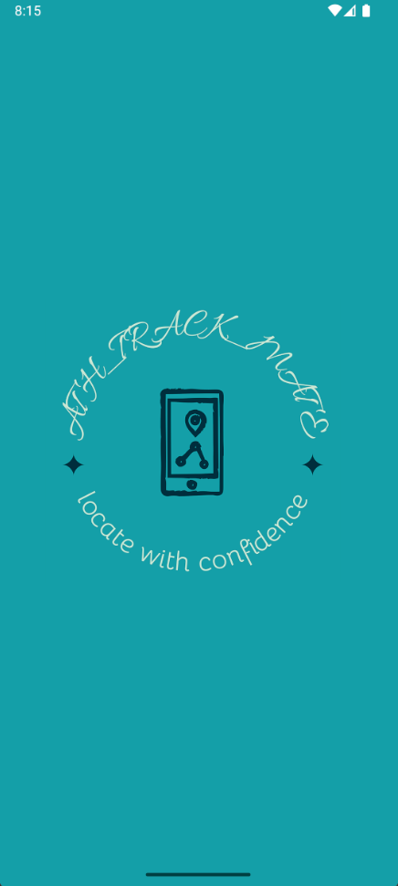
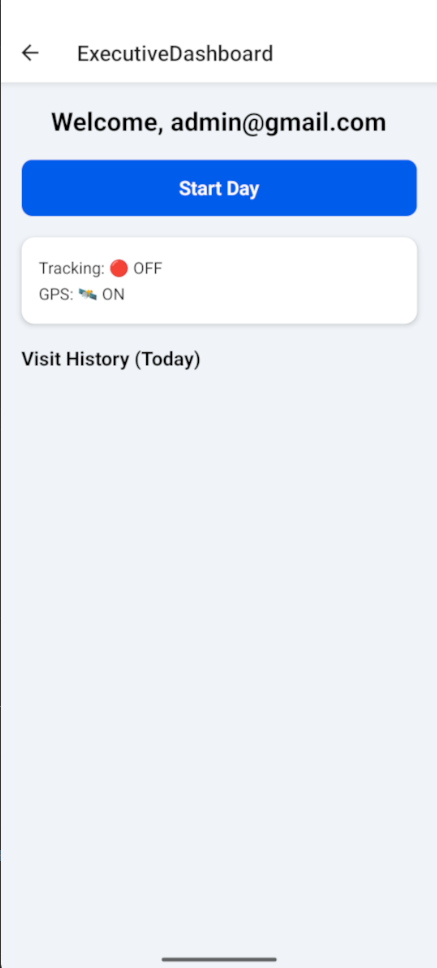

# 🛰️ Executive Tracking App

**Executive Tracking App** is a mobile application designed for field executives to log in, start their workday, and be tracked in real-time with GPS data. The app helps managers monitor employee location history and daily movement efficiently.

---

## 📱 Screenshots

| Splash Screen | Login Screen |
|---------------|---------------|
|  |  |

| Dashboard (Tracking OFF) | Dashboard (Tracking ON) |
|--------------------------|-------------------------|
|  |  |

> You can store the above images inside a folder like `assets/` in your project root.

---

## ✨ Features

- 🔐 Secure Login with Email and Password
- 🛰️ Start/Stop Day functionality to toggle location tracking
- ✅ Real-time GPS status and accuracy
- 📍 Periodic location tracking (latitude, longitude, and timestamp)
- 📖 Daily visit history log
- 🎯 Simple and intuitive UI

---

## 🛠️ Tech Stack

- **React Native CLI** (Not Expo)
- **React Navigation**
- **Axios** for API calls
- **Geolocation API** (React Native built-in)
- **Android Emulator** or Physical Device

---

## 🚀 Getting Started

### Prerequisites

- Node.js ≥ 18
- React Native CLI
- Android Studio (with SDK ≥ 33)
- A device or emulator with location services enabled

### Installation

git clone https://github.com/yourusername/executive_app.git
cd executive_app
npm install
npx react-native run-android

---
## 🔑 How It Works
User logs in with their credentials.
-On successful login, they are navigated to the Executive Dashboard.
-Pressing Start Day begins GPS tracking every 4 minutes.
-The visit history is updated in real-time on the dashboard.
-Pressing Stop Day ends the tracking session.
---
## 🧪 Development Notes
-Location accuracy is set to 5 meters
-Tracking only activates after pressing Start Day
-Visit History logs timestamps, coordinates, and accuracy

---
## 📫 Reach me:
-📧 Email: nidhaandubey2@gmail.com
-💼 LinkedIn: https://www.linkedin.com/in/nidhaan-dubey-73a790250/
